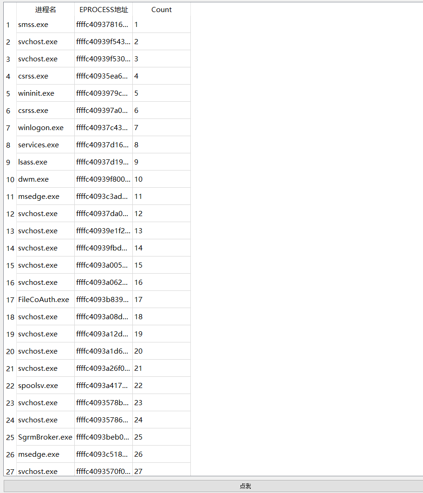

# ARK工具V1.0.0

做大做强第一步，搭了个雏形，用的刚学了皮毛的QT框架（本人是MFC选手，虽然也是半吊子）

目前的功能是检索出任何存在的进程，输出它们的EPROCESS对象的地址，以及进程名

用的方法是这样的：

1.获取PspCidTable表的地址，原理是PsLookupProcessByProcessId（被导出） -> PspReferenceCidTableEntry -> PspCidTable

2.通过PspCidTable表获取全部的EPROCESS

3.对这些EPROCESS进行校验，因为实践发现，不合法的EPROCESS实在是太多了，原理是`EPROCESS->SectionObject(_SECTION)->ControlArea (_CONTROL_AREA)->FilePointer( _FILE_OBJECT)`( [win10 1511版本之后，_SECTION_OBJECT结构体哪去了？ - WINDOWS核心编程 - 紫水晶编程技术论坛 - 努力打造成全国最好的编程论坛 - Powered by Discuz!](http://www.m5home.com/bbs/thread-9466-1-1.html) )

4.剩下的就打包发给三环进行显示

效果图（有点拙劣，后续改进）

